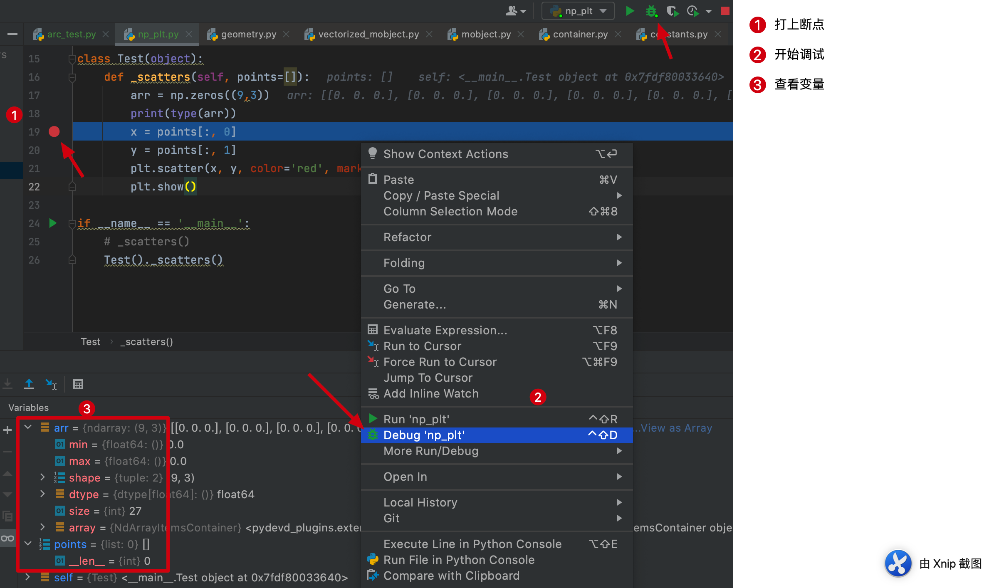
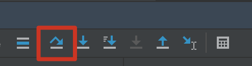
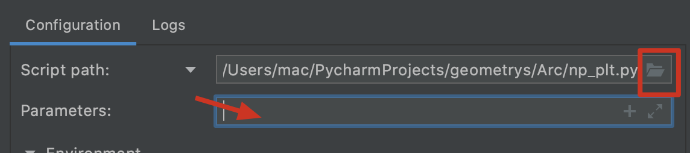
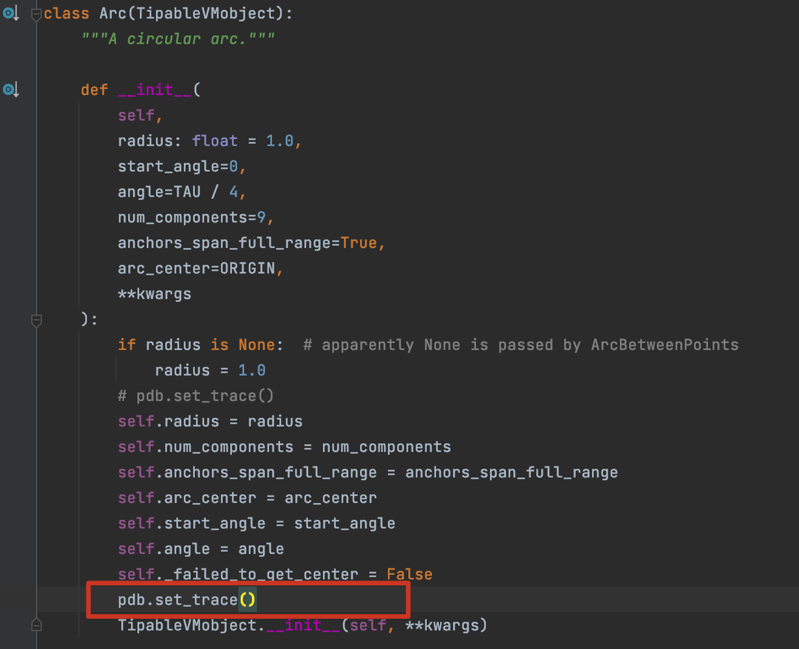
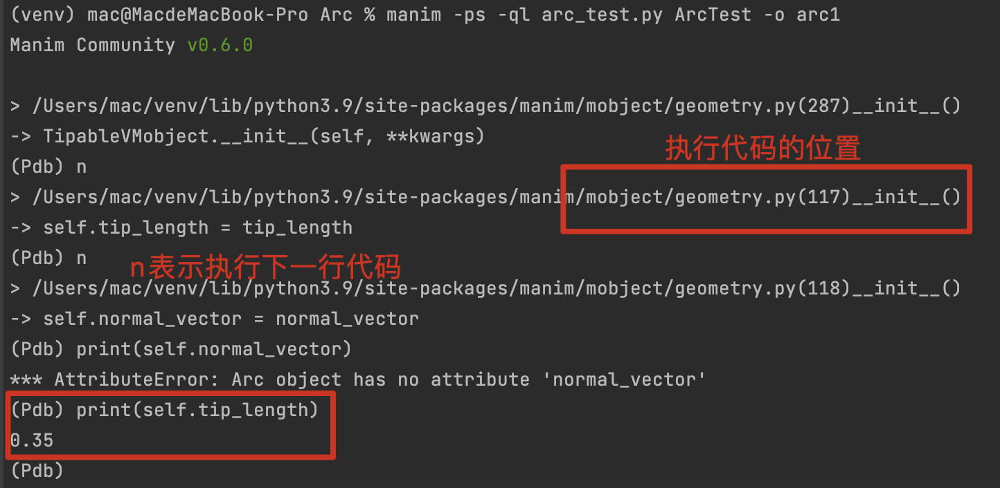

# python编码规范

> 代码演进和维护会消耗大部分精力，遵循良好的规范是提高效率节约成本的根本途径
>
> 在PyCharm中添加注释方便快捷

## 命名

> 类名称

- 类的实例叫做对象，我们用到的`VMobject`，`Animation`等对象都能找到具体的类定义

- 类可以理解成定义对象功能的集合，想要对象实现某个功能，可以在类中编写对应的函数

- 类中的成员变量也叫做属性（self），成员函数也叫做方法

- 因此，类的命名应该能体现出主要功能的英文名称，采用驼峰命名法，首字母大写

  - 举例：定义一个绘制表格的类，`class DrawingTables(object)`

  > 函数名称

- 同理，函数的命名仍采用驼峰命名法，首字母小写，能够表示函数功能

- 函数名称配合下划线`_`（后续填坑）

- manim库的开发者使用下划线命名，例如`def set_style()`、`def move_to()`

> 变量名称

- 有人提倡使用匈牙利命名法（变量名=属性+类型+对象描述）
- 一般保证能体现出意义即可，下划线隔开，即manim中的做法，例如`stroke_width`
- 全局变量大写

## 注释

> 类注释

- 使用`''' '''`，也叫做批量注释，也可以使用`""" """`

  ```python
  class Circle(Arc):
      '''
      这里是圆的定义，继承自Arc
      '''
      def __init__(
          self,
          radius: float = None,
          color=RED,
          close_new_points=True,
          anchors_span_full_range=False,
          **kwargs
      ):
          Arc.__init__(
              self,
              radius=radius,
              start_angle=0,
              angle=TAU,
              color=color,
              close_new_points=close_new_points,
              anchors_span_full_range=anchors_span_full_range,
              **kwargs
          )
  ```

> 函数注释

- 同样使用批量注释的符号，会自动生成各参数的注释

  ```python
  def point_at_angle(self, angle):
      '''
      :param angle: 角度
      :return: 
      '''
      start_angle = angle_of_vector(self.points[0] - self.get_center())
      return self.point_from_proportion((angle - start_angle) / TAU)
  ```

- 最常用的注释是`#`，一般使用在某一行代码之后或上方

  - 我们可以用层级关系让注释更加易读，例如：

  ```python
  def construct(self):
      '''
      :param return:
      '''
     	# 定义两条直线
      line1 = Line(LEFT, RIGHT)
      line2 = Line(DOWN, UP)
      
      # 定义角度
      rightarcangles = [
          ## 使用默认参数
          Angle(line1, line2, dot=True),
          ## quadrant决定在哪个象限
          Angle(line1, line2, radius=0.8, quadrant=(1,-1), dot=True, other_angle=True, elbow=True),
          Angle(line1, line2, radius=0.8, quadrant=(-1,1), stroke_width=8, dot=True, dot_color=YELLOW, dot_radius=0.04, other_angle=True),
          Angle(line1, line2, radius=0.5, quadrant=(-1,-1), color=RED, dot=True, dot_color=GREEN, dot_radius=0.08),
      ]
      plots = VGroup()
      for angle in rightarcangles:
          plot=VGroup(line1.copy(),line2.copy(), angle)
          plots.add(plot)
          plots.arrange(buff=1.5)
          self.add(plots)
  ```

- `# TODO`

  - 使用TODO标记我们要在接下来的代码中实现的功能，可以用在类和函数，甚至一个py文件中

  ```python
  # TODO:我接下来想写一个函数，很牛逼的那种！！！
  ```

  

- 先到这吧

## 函数名称与下划线

- 接着来（2021/06/09）第二次分享会
- 解释一下Python中非常常见的一个现象：下划线函数的命名规则


## 调试

- 很多时候直接输出的结果不能反映代码执行的流程，可以通过调试查看
- 常见的调试方法分三种：暴力输出、打断点、使用Python的`pdb`工具

> 暴力输出

- 还要我说吗？

> 打断点

- 断点的作用就是将代码的执行暂停到此处，方便我们查看已经压栈的变量

- 在PyCharm中添加断点使用调试（debug）模式

  

  - 刚开始debug断点处还未执行，还没有x变量，执行后会出现，如何**单步**往下走？（执行下一行代码？），点击下面这个

    

  - 注：线Run一下看你代码有没有错，不然debug会直接退出也不报错！

> pdb工具

- 有事是程序通过命令行（terminal）启动的，怎么传参？有两种方法：

- 第一种：配置

  

  - 找到你要运行的文件，输入传递的参数：

    

- 第二种：`pdb`工具

  - 在我们想要执行的函数内部放上这样一行代码即可（不用导包）

    

  - 还是在terminal运行代码，就会停在这，可以`print`查看内部变量，重要的是它会提示代码的运行过程

    

  - 先到这吧！

