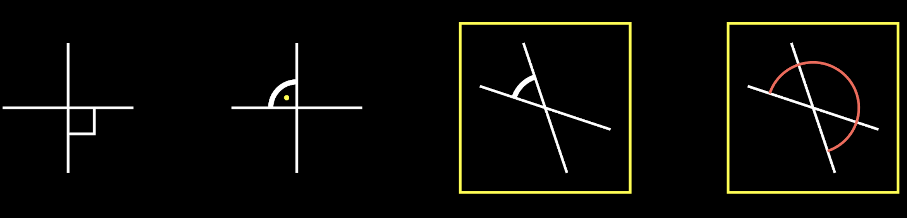
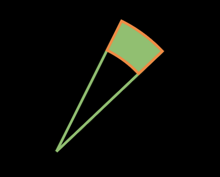

# geometry

- 这部分介绍几何对象：`manim.mobject.geometry`
- 这里是2D图形，主要分为以下几部分：
  - 角度
  - 环
  - 点
  - 弧
  - 箭头
  - 正方形
  - 圆
  - 三角形
  - 正方形
  - 多边形

## Angle

- 进入`Angle`的定义，可以看到用例和如下初始化参数：

  ```python
  def __init__(
          self,
          line1,
          line2,
          radius=None,
          quadrant=(1, 1),
          other_angle=False,
          dot=False,
          dot_radius=None,
          dot_distance=0.55,
          dot_color=WHITE,
          elbow=False,
          **kwargs
  ):
  ```

  - `line`建立象限，这里线的夹角决定了弧度（默认第一象限），即确定圆弧`Arc`中的锚点
  - `radius`确定圆弧的半径
  - `quadrant`确定使用哪个象限，有四个不同值：`(1,1), (-1,1), (1,-1), (-1,-1)`
  - `other_angle`决定所画角度的方向
    - 设置为`False`（默认值），弧将始终从线1上的点逆时针旋转，直到
      到达线2的点
    - 设置为`True`，则角度将从线2顺时针转到线1
  - `dot`一般用来表示这是直角，后续的参数都是对`Dot`对象的定义
  - `elbow`设置为`True`会生成表示直角的矩形，dot失效

- 使用如下代码，看看效果：

  ```python
  class AngleTest(Scene):
      '''
      terminal:manim -psqh angle.py AngleTest -o angle3
      '''
      def construct(self):
          line1 = Line(LEFT, RIGHT)
          line2 = Line(DOWN, UP)
          line3 = Line(LEFT + (1 / 3) * UP, RIGHT + (1 / 3) * DOWN)
          line4 = Line(DOWN + (1 / 3) * RIGHT, UP + (1 / 3) * LEFT)
  
          angles1 = [
              Angle(line1, line2, radius=0.4, quadrant=(1, -1), dot=True, other_angle=True, elbow=True),
              Angle(line1, line2, radius=0.4, quadrant=(-1, 1), stroke_width=8, dot=True, dot_color=YELLOW,
                    dot_radius=0.04, other_angle=True)
          ]
  
          angles2 = [
              Angle(line3, line4, radius=0.5, quadrant=(-1, 1), stroke_width=8, other_angle=True),
              Angle(line3, line4, radius=0.7, quadrant=(-1, -1), color=RED, other_angle=True),
          ]
  
          plots = VGroup()
          for angle in angles1:
              plot = VGroup(line1.copy(), line2.copy(), angle)
              plots.add(plot)
          for angle in angles2:
              plot = VGroup(line3.copy(), line4.copy(), angle)
              plots.add(VGroup(plot, SurroundingRectangle(plot, buff=0.3)))
          plots.arrange(buff=1.5)
          self.add(plots)
  ```

  

> 查看源码，了解一些常用方法

- `get_start()`：获取对象的起点坐标

  ```python
  def get_start(self):
    	# 这里的tip可以理解成point
  		if self.has_start_tip():
  				return self.start_tip.get_start()
      else:
          return VMobject.get_start(self)
        
  def has_start_tip(self):
    	# hasattr()判断类对象是否有某个属性
      # getattr()可以获取属性值或方法地址（可执行）
      return hasattr(self, "start_tip") and self.start_tip in self
  ```

  - 在Angle类的源码中，使用了`line1.get_start()...`，那么`Line`对象有没有定义`start_tip`属性呢？
  - 跟踪代码可以找到继承的 `TipableVMobject `类，顾名思义，继承此类的对象都是有`tip`属性的

- `line_intersection()`：获取两条直线的交点坐标

  ```python
  # 使用方法：
  inter = line_intersection(
      [line1.get_start(), line1.get_end()], [line2.get_start(), line2.get_end()]
  )
  ```

- `set_points_as_corners()`：给一组点，生成的对象设置为vmobject对象的角

  ```python
  def set_points_as_corners(self, points: Sequence[float]) -> "VMobject":
  		nppcc = self.n_points_per_cubic_curve	# 4 每个曲线包含的点数
      points = np.array(points)
      self.set_anchors_and_handles(
        # 生成器，函数产生的值作为参数传递，因为存在列表里，使用*解包单个传递
        *[interpolate(points[:-1], points[1:], a) for a in np.linspace(0, 1, nppcc)]
      )
      return self
  
  # bezier.py 好好研究研究
  def interpolate(start: int, end: int, alpha: float) -> float:
      return (1 - alpha) * start + alpha * end
    
  def set_anchors_and_handles(
      self,
      anchors1: Sequence[float],
      handles1: Sequence[float],
      handles2: Sequence[float],
      anchors2: Sequence[float],
  ) -> "VMobject":
  ```

  - 这里涉及到**贝塞尔曲线**的知识，因为控制简便却具有极强的描述能力，bezier curve在工业设计领域应用广泛，可以查资料学习
  - 从代码层面来看，`np.linspace()`在这里得到包含4个点的等差数列，然后使用自定义的`interpolate`插值模块
  - 最后调用了`set_anchors_and_handles()`得到生成的角，`anchors`和`handles`是理解的关键
    - 通过PS中的钢笔工具可以理解，anchor是设置的锚点，handle是控制曲线的柄，操作”柄“，即可生成由锚点决定的贝塞尔曲线，拟合出我们想要的图形！
    - 从上面的代码可以看出是用了两组`anchor/handle`，代入后方程拟合得到的锚点很多，添加为`points`属性
  - 类似的，有`set_points_smoothly()`方法

- `SurroundingRectangle`类：将对象用矩形包裹住

  ```python
  class SurroundingRectangle(Rectangle):
      def __init__(self, mobject, color=YELLOW, buff=SMALL_BUFF, **kwargs):
          self.color = color
          self.buff = buff
          Rectangle.__init__(
              self,
              color=color,
              width=mobject.width + 2 * self.buff,
              height=mobject.height + 2 * self.buff,
              **kwargs
          )
          self.move_to(mobject)
  ```

  - 可以指定颜色，`buff`、`stroke_width`等参数

> 最后，再来研究一下官方提供的这段代码：

- 效果如图：

  

  ```python
  class FilledAngle(Scene):
      '''
      terminal:manim -psqh angle.py FilledAngle -o angle4
      '''
      def construct(self):
          l1 = Line(ORIGIN, 2 * UP + RIGHT).set_color(GREEN)
          l2 = (
              Line(ORIGIN, 2 * UP + RIGHT)
              .set_color(GREEN)
              .rotate(-20 * DEGREES, about_point=ORIGIN)
          )
          norm = l1.get_length()
          a1 = Angle(l1, l2, other_angle=True, radius=norm - 0.5).set_color(GREEN)
          a2 = Angle(l1, l2, other_angle=True, radius=norm).set_color(GREEN)
          q1 = a1.get_points()
          q2 = a2.reverse_direction().get_points() 
          pnts = np.concatenate([q1, q2, q1[0].reshape(1, 3)])
          mfill = VMobject().set_color(ORANGE)
          mfill.set_points_as_corners(pnts).set_fill(GREEN, opacity=1)
          self.add(l1, l2)
          self.add(mfill)
  ```

- `rotate()`：旋转对象

  ```python
  # 参数
  def rotate(
      self,
      angle,
      axis=OUT,
      about_point: Optional[Sequence[float]] = None,
      **kwargs,
  )
  ```

  - 常用`axis`参数按照某个轴旋转，3D图形下可以传入`X_AXIS`或`Y_AXIS`和`Z_AXIS`
  - 2D下我们一般使用`ORIGIN`，指定按照某个点旋转

- `get_points()`：得到对象的锚点

  ```python
  def get_points(self):
      return np.array(self.points)
  ```

  - 可以**追踪**到`VMobject`，有对应的`set_points()`方法，通过PyCharm的Find Usages功能可以发现，用在了`CubicBezier`类和`Line`类中
  - 但是，这里的`points`属性是在`Arc`的`generate_points()`方法中得到的，其中调用了一个关键方法`set_pre_positioned_points()`，最后还是到了`set_anchors_and_handles()`方法

  ```python
  def generate_points(self):
      if self.elbow:
          Elbow.generate_points(self)
      else:
          Arc.generate_points(self)
  ```

  

