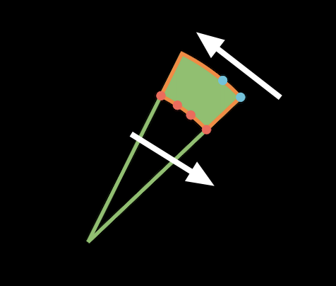

# geometry

- 这部分介绍几何对象：`manim.mobject.geometry`
- 这里是2D图形，主要分为以下几部分：
    - 角度
    - 环
    - 点
    - 弧
    - 箭头
    - 正方形
    - 圆
    - 三角形
    - 正方形
    - 多边形

## Angle

- 进入`Angle`的定义，可以看到用例和如下初始化参数：

    ```python
    def __init__(
        self,
        line1,
        line2,
        radius=None,
        quadrant=(1, 1),
        other_angle=False,
        dot=False,
        dot_radius=None,
        dot_distance=0.55,
        dot_color=WHITE,
        elbow=False,
        **kwargs
    ):
    ```

    - `line`建立象限，这里线的夹角决定了弧度（默认第一象限），即确定圆弧`Arc`中的锚点
        - 角度需要边表示，所以这里直接引入两条直线
        - 参数计算后最终传递给了类`Arc`，在线上初始化一段弧，形成角度
    - `radius`确定圆弧的半径
    - `quadrant`确定使用哪个象限，有四个不同值：`(1,1), (-1,1), (1,-1), (-1,-1)`，分别表示四个象限
    - `other_angle`决定所画角度的方向
        - 设置为`False`（默认值），弧将始终从线1上的点逆时针旋转，直到
            到达线2的点
        - 设置为`True`，则角度将从线2顺时针转到线1
    - `dot`一般用来表示这是直角，后续的参数都是对`Dot`对象的定义
    - `elbow`设置为`True`会生成表示直角的矩形，dot失效

- 使用如下代码，看看效果：

    ```python
    class AngleTest(Scene):
        '''
        terminal:manim -psqh angle.py AngleTest -o angle3
        '''
        def construct(self):
            line1 = Line(LEFT, RIGHT)
            line2 = Line(DOWN, UP)
            line3 = Line(LEFT + (1 / 3) * UP, RIGHT + (1 / 3) * DOWN)
            line4 = Line(DOWN + (1 / 3) * RIGHT, UP + (1 / 3) * LEFT)
    
            angles1 = [
              	Angle(line1, line2, radius=0.4, quadrant=(1, -1), dot=True, other_angle=True, elbow=True),
              	Angle(line1, line2, radius=0.4, quadrant=(-1, 1), stroke_width=8, dot=True, dot_color=YELLOW,
                    dot_radius=0.04, other_angle=True)
            ]
    
            angles2 = [
              	Angle(line3, line4, radius=0.5, quadrant=(-1, 1), stroke_width=8, other_angle=True),
              	Angle(line3, line4, radius=0.7, quadrant=(-1, -1), color=RED, other_angle=True),
            ]
    
            plots = VGroup()
            for angle in angles1:
              	plot = VGroup(line1.copy(), line2.copy(), angle)
              	plots.add(plot)
    				for angle in angles2:
                plot = VGroup(line3.copy(), line4.copy(), angle)
                plots.add(VGroup(plot, SurroundingRectangle(plot, buff=0.3)))
                plots.arrange(buff=1.5)
                self.add(plots)
    ```

    ​	

> 查看源码，了解一些常用方法：

- `get_start()`：获取对象的起点坐标

    ```python
    def get_start(self):
        # 这里的tip可以理解成point
        if self.has_start_tip():
          	return self.start_tip.get_start()
        else:
          	return VMobject.get_start(self)
          
    def has_start_tip(self):
    		# hasattr()判断类对象是否有某个属性
        # getattr()可以获取属性值或方法地址（可执行）
        return hasattr(self, "start_tip") and self.start_tip in self
    ```

    - 在Angle类的源码中，使用了`line1.get_start()...`，那么`Line`对象有没有定义`start_tip`属性呢？
    - 跟踪代码可以找到继承的 `TipableVMobject `类，顾名思义，继承此类的对象都是有`tip`属性的

- `line_intersection()`：获取两条直线的交点坐标

    ```python
    # 使用方法：
    inter = line_intersection(
        [line1.get_start(), line1.get_end()], [line2.get_start(), line2.get_end()]
    )
    ```

- `set_points_as_corners()`：给一组点，生成的对象设置为vmobject对象的角

    ```python
    def set_points_as_corners(self, points: Sequence[float]) -> "VMobject":
    		nppcc = self.n_points_per_cubic_curve	# 4 每个曲线包含的点数
        points = np.array(points)
        self.set_anchors_and_handles(
          # 生成器，函数产生的值作为参数传递，因为存在列表里，使用*解包单个传递
          *[interpolate(points[:-1], points[1:], a) for a in np.linspace(0, 1, nppcc)]
        )
        return self
    
    # bezier.py 好好研究研究
    def interpolate(start: int, end: int, alpha: float) -> float:
        return (1 - alpha) * start + alpha * end
      
    def set_anchors_and_handles(
        self,
        anchors1: Sequence[float],
        handles1: Sequence[float],
        handles2: Sequence[float],
        anchors2: Sequence[float],
    ) -> "VMobject":
    ```

    - 这里涉及到**贝塞尔曲线**的知识，因为控制简便却具有极强的描述能力，bezier curve在工业设计领域应用广泛，可以查资料学习
    - 从代码层面来看，`np.linspace()`在这里得到(0,1)之间包含4个点的等差数列，然后使用自定义的`interpolate`插值模块，得到4批由贝塞尔方程得到的数据（例如每批数据的shape为（64，3）的nparray）
        - 插值是数据不足情况下增加样本点的方法，但这里
    - 最后调用了`set_anchors_and_handles()`得到生成的角，`anchors`和`handles`是理解的关键
        - 通过PS中的钢笔工具可以理解，anchor是设置的锚点，handle是控制曲线的柄，操作”柄“，即可生成由锚点决定的贝塞尔曲线，拟合出我们想要的图形！
        - 上面的代码就是将4批锚点和控制柄的数据传入，这些点作为points属性添加到VMobject对象，形成图形！
    - 类似的，有`set_points_smoothly()`方法
    - 看到这，可以发现这个方法其实是非常通用的，或者说这里的"角"是一个指代，最终生成的形状取决于传入的anchors和handles

- `SurroundingRectangle`类：将对象用矩形包裹住

    ```python
    class SurroundingRectangle(Rectangle):
        def __init__(self, mobject, color=YELLOW, buff=SMALL_BUFF, **kwargs):
            self.color = color
            self.buff = buff
            Rectangle.__init__(
                self,
                color=color,
                width=mobject.width + 2 * self.buff,
                height=mobject.height + 2 * self.buff,
                **kwargs
            )
            self.move_to(mobject)
    ```

    - 可以指定颜色，`buff`、`stroke_width`等参数

> 最后，再来研究一下官方提供的这段代码：

- 效果如图：

    

    ```python
    # 示例代码
    class FilledAngle(Scene):
        '''
        terminal:manim -psqh angle.py FilledAngle -o angle4
        '''
        def construct(self):
            l1 = Line(ORIGIN, 2 * UP + RIGHT).set_color(GREEN)
            l2 = (
                Line(ORIGIN, 2 * UP + RIGHT)
                .set_color(GREEN)
                .rotate(-20 * DEGREES, about_point=ORIGIN)
            )
            norm = l1.get_length()
            a1 = Angle(l1, l2, other_angle=True, radius=norm - 0.5).set_color(GREEN)
            a2 = Angle(l1, l2, other_angle=True, radius=norm).set_color(GREEN)
            q1 = a1.get_points()
            q2 = a2.reverse_direction().get_points() # 否则会生成交叉的图形
            pnts = np.concatenate([q1, q2, q1[0].reshape(1, 3)])
            mfill = VMobject().set_color(ORANGE)
            mfill.set_points_as_corners(pnts).set_fill(GREEN, opacity=1)
            self.add(l1, l2)
            self.add(mfill)
    # 重点解释一下用到的函数
    ```

- `set_color()`：设置对象的边线颜色

    ```python
    def set_color(self, color, family=True):
        self.set_fill(color, family=family)
        self.set_stroke(color, family=family)
    
        # check if a list of colors is passed to color
        if isinstance(color, str):
            self.color = colour.Color(color)
        else:
            self.color = color
            return self
      
    ```

    - 这个`family`参数什么作用呢？

    ```python
    def set_fill(self, color=None, opacity=None, family=True):
        # 如果包含子对象，是否需要设置子对象的颜色
        if family:
            for submobject in self.submobjects:
                submobject.set_fill(color, opacity, family)
        self.update_rgbas_array("fill_rgbas", color, opacity)
        if opacity is not None:
            self.fill_opacity = opacity
        return self
    ```

- `rotate()`：旋转对象

    ```python
    # 参数
    def rotate(
        self,
        angle,
        axis=OUT,
        about_point: Optional[Sequence[float]] = None,
        **kwargs,
    )
    ```

    - 常用`axis`参数按照某个轴旋转，3D图形下可以传入`X_AXIS`或`Y_AXIS`和`Z_AXIS`
    - 2D下我们一般使用`ORIGIN`，指定按照某个点旋转

- `get_points()`：得到对象的锚点

    ```python
    def get_points(self):
        return np.array(self.points)
    ```

    - 可以**追踪**到`VMobject`，有对应的`set_points()`方法，通过PyCharm的Find Usages功能可以发现，用在了`CubicBezier`类和`Line`类中
    - 但是，这里的`points`属性是在`Arc`的`generate_points()`方法中得到的（弧是用Arc得到的），其中调用了一个关键方法`set_pre_positioned_points()`，最后还是到了`set_anchors_and_handles()`方法

    ```python
    def generate_points(self):
        if self.elbow:
            Elbow.generate_points(self)
        else:
            # 很多对象都是有这个方法的
            Arc.generate_points(self)
    ```

    - 注：这些点是有顺序的，所以示例代码中有`reverse_direction()`方法，按路径描绘图形

    ```python
    # 我们在示例代码后加几行代码就比较清楚了
    dot1 = Dot(q1[0], radius=0.05, color=RED)
    dot2 = Dot(q1[10], radius=0.05, color=RED)
    dot3 = Dot(q1[20], radius=0.05, color=RED)
    dot4 = Dot(q1[31], radius=0.05, color=RED)	# shape (32, 3)	[1.26065519 1.19359981 0.        ]
    self.add(dot1, dot2, dot3, dot4)	
    
    dot5 = Dot(q2[0], radius=0.05, color=BLUE)	# [1.62373291 1.5373651  0.        ]
    dot6 = Dot(q2[10], radius=0.05, color=BLUE)
    # dot7 = Dot(q2[20], radius=0.05, color=RED)
    # dot8 = Dot(q2[31], radius=0.05, color=RED)
    self.add(dot5, dot6)
    ```

    

    - 如图，贝塞尔曲线上的点传入的顺序如箭头所示，`q1[31]`和`q2[0]`的tan值都是0.9468，因此连成了直线

- `np.concatenate()`：数组拼接

    ```python
    a=np.array([[1,2,3],[4,5,6]])
    b=np.array([[11,21,31],[7,8,9]])
    # x轴拼接
    np.concatenate((a,b),axis=0)
    array([[ 1,  2,  3],
           [ 4,  5,  6],
           [11, 21, 31],
           [ 7,  8,  9]])
    # y轴拼接，即将对应行拼接
    np.concatenate((a,b),axis=1)
    array([[ 1,  2,  3, 11, 21, 31],
           [ 4,  5,  6,  7,  8,  9]])
    ```

    - `numpy`在数据科学领域用的很广泛，可以了解一下规则

- 这里get到的points就是贝塞尔曲线的关键点，因此传入set函数后可以生成与之前图形重合的封闭部分；这种一种操作图形的思路

- 类似的用法在Angle源码中也能看到：

    ```python
    # 传入的anchor_middle是直角符号拐点的坐标，因为是计算得到，tan角度一致，所以能得到直角
    self.set_points_as_corners([anchor_angle_1, anchor_middle, anchor_angle_2])
    ```

- 可以发现，`Arc`类是很多类的基础，也涉及使用贝塞尔曲线的方法，研究一下~

## Arc


